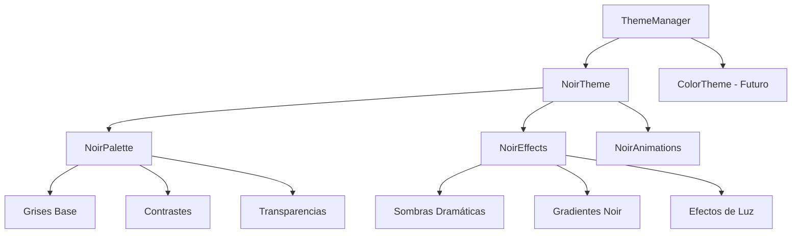
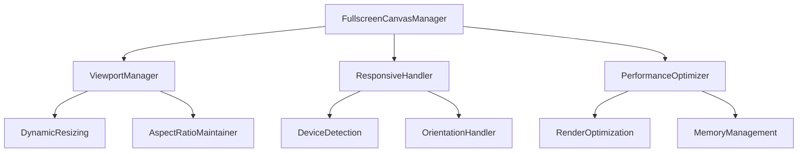
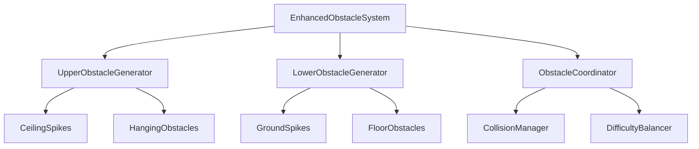

# Design Document - Transformación Visual Noir de Spikepulse

## Overview

Este documento define el diseño técnico para transformar Spikepulse hacia una estética noir cinematográfica moderna. La transformación incluye una paleta monocromática elegante, canvas de pantalla completa, obstáculos superiores, y una arquitectura preparada para la evolución gradual hacia acentos de color.

## Architecture

### Sistema de Temas Visual



### Arquitectura de Canvas Fullscreen



### Sistema de Obstáculos Bidireccional



## Components and Interfaces

### 1. NoirThemeManager

**Responsabilidad:** Gestionar la paleta noir y preparar la transición futura a colores.

```javascript
class NoirThemeManager {
    constructor(config, eventBus) {
        this.currentTheme = 'noir';
        this.noirPalette = new NoirPalette();
        this.colorTransitionSystem = new ColorTransitionSystem();
        this.effectsManager = new NoirEffectsManager();
    }

    // Métodos principales
    applyNoirTheme()
    prepareColorTransition()
    updateThemeVariables()
    getThemeColors()
}
```

**Interfaz:**
```javascript
interface IThemeManager {
    applyTheme(themeName: string): void;
    getColor(colorKey: string): string;
    updatePalette(newPalette: object): void;
    enableColorTransition(): void;
}
```

### 2. FullscreenCanvasManager

**Responsabilidad:** Gestionar el canvas de pantalla completa con optimizaciones de rendimiento.

```javascript
class FullscreenCanvasManager {
    constructor(canvas, config, eventBus) {
        this.canvas = canvas;
        this.ctx = canvas.getContext('2d');
        this.viewportManager = new ViewportManager();
        this.responsiveHandler = new ResponsiveHandler();
        this.performanceOptimizer = new PerformanceOptimizer();
    }

    // Métodos principales
    enableFullscreen()
    handleResize()
    optimizeForDevice()
    maintainAspectRatio()
}
```

**Interfaz:**
```javascript
interface IFullscreenManager {
    setFullscreen(enabled: boolean): void;
    resize(width: number, height: number): void;
    getViewportDimensions(): {width: number, height: number};
    optimizePerformance(): void;
}
```

### 3. EnhancedObstacleSystem

**Responsabilidad:** Generar y gestionar obstáculos tanto superiores como inferiores.

```javascript
class EnhancedObstacleSystem {
    constructor(config, eventBus) {
        this.upperGenerator = new UpperObstacleGenerator();
        this.lowerGenerator = new LowerObstacleGenerator();
        this.coordinator = new ObstacleCoordinator();
        this.collisionManager = new EnhancedCollisionManager();
    }

    // Métodos principales
    generateObstaclePair(x, difficulty)
    updateObstacles(deltaTime)
    checkCollisions(player)
    adaptToGravityChange(gravityState)
}
```

**Interfaz:**
```javascript
interface IObstacleSystem {
    generateObstacle(position: number, type: string): Obstacle;
    updateObstacles(deltaTime: number): void;
    checkCollisions(entity: Entity): CollisionResult[];
    clearObstacles(): void;
}
```

### 4. NoirRenderer

**Responsabilidad:** Renderizado optimizado con efectos noir y soporte para pantalla completa.

```javascript
class NoirRenderer extends Renderer {
    constructor(config, eventBus) {
        super(config, eventBus);
        this.noirEffects = new NoirEffectsProcessor();
        this.shadowSystem = new DramaticShadowSystem();
        this.contrastEnhancer = new ContrastEnhancer();
    }

    // Métodos específicos noir
    applyNoirFilters(ctx)
    renderDramaticShadows(ctx, objects)
    enhanceContrast(ctx)
    renderCinematicEffects(ctx)
}
```

## Data Models

### NoirPalette

```javascript
const NOIR_PALETTE = {
    // Escala de grises principal
    black: '#000000',
    darkGray: '#1a1a1a',
    mediumGray: '#404040',
    lightGray: '#808080',
    white: '#ffffff',
    
    // Grises con matices
    warmGray: '#2a2a2a',
    coolGray: '#1e1e2e',
    
    // Transparencias noir
    shadowLight: 'rgba(0, 0, 0, 0.3)',
    shadowMedium: 'rgba(0, 0, 0, 0.6)',
    shadowHeavy: 'rgba(0, 0, 0, 0.9)',
    
    // Highlights dramáticos
    highlight: 'rgba(255, 255, 255, 0.1)',
    dramaticHighlight: 'rgba(255, 255, 255, 0.3)',
    
    // Preparación para colores futuros
    colorSlot1: '#404040', // Se convertirá en dorado
    colorSlot2: '#606060', // Se convertirá en rojo
    colorSlot3: '#505050', // Se convertirá en púrpura
};
```

### FullscreenConfig

```javascript
const FULLSCREEN_CONFIG = {
    canvas: {
        minWidth: 320,
        minHeight: 240,
        maxWidth: 3840,
        maxHeight: 2160,
        aspectRatio: 16/9,
        maintainAspectRatio: true
    },
    
    performance: {
        enableDynamicQuality: true,
        targetFPS: 60,
        qualityThresholds: {
            low: { width: 1280, height: 720 },
            medium: { width: 1920, height: 1080 },
            high: { width: 2560, height: 1440 }
        }
    },
    
    responsive: {
        breakpoints: {
            mobile: 768,
            tablet: 1024,
            desktop: 1440
        },
        adaptiveUI: true,
        touchOptimization: true
    }
};
```

### ObstacleConfiguration

```javascript
const ENHANCED_OBSTACLE_CONFIG = {
    upper: {
        types: ['ceiling_spike', 'hanging_tech', 'stalactite'],
        spawnHeight: 0.1, // 10% desde arriba
        maxHeight: 0.4,   // 40% de la pantalla
        density: 0.3
    },
    
    lower: {
        types: ['ground_spike', 'floor_tech', 'stalagmite'],
        spawnHeight: 0.9, // 90% desde arriba (cerca del suelo)
        maxHeight: 0.4,   // 40% de la pantalla
        density: 0.4
    },
    
    coordination: {
        minGap: 100,      // Espacio mínimo entre obstáculos superior/inferior
        maxGap: 200,      // Espacio máximo
        alignmentChance: 0.3, // Probabilidad de alineación vertical
        offsetVariation: 50   // Variación en el offset
    }
};
```

## Error Handling

### Estrategia de Manejo de Errores

1. **Fallback Gracioso para Temas:**
   - Si falla la carga del tema noir, usar paleta básica monocromática
   - Mantener funcionalidad core sin efectos visuales avanzados

2. **Recuperación de Canvas Fullscreen:**
   - Detectar fallos de redimensionamiento
   - Volver a tamaño fijo si fullscreen falla
   - Mantener aspect ratio mínimo funcional

3. **Gestión de Obstáculos:**
   - Si falla generación de obstáculos superiores, continuar solo con inferiores
   - Validar posiciones antes de crear obstáculos
   - Limpiar obstáculos corruptos automáticamente

```javascript
class NoirErrorHandler {
    handleThemeError(error) {
        console.warn('Noir theme error, falling back to basic monochrome');
        this.applyBasicMonochrome();
    }
    
    handleFullscreenError(error) {
        console.warn('Fullscreen error, reverting to fixed size');
        this.revertToFixedSize();
    }
    
    handleObstacleError(error) {
        console.warn('Obstacle generation error, using safe fallback');
        this.useSafeObstacleGeneration();
    }
}
```

## Testing Strategy

### 1. Tests Unitarios

**NoirThemeManager Tests:**
- Aplicación correcta de paleta noir
- Transición suave entre temas
- Validación de colores generados
- Preparación para colores futuros

**FullscreenCanvasManager Tests:**
- Redimensionamiento correcto
- Mantenimiento de aspect ratio
- Optimización de rendimiento
- Compatibilidad con dispositivos

**EnhancedObstacleSystem Tests:**
- Generación de obstáculos superiores e inferiores
- Coordinación entre obstáculos
- Detección de colisiones bidireccional
- Adaptación a cambios de gravedad

### 2. Tests de Integración

**Flujo Visual Completo:**
- Carga de tema noir → Canvas fullscreen → Renderizado optimizado
- Transición de menú → Juego → Game over con estética consistente
- Cambio de orientación → Redimensionamiento → Mantenimiento visual

**Sistema de Obstáculos Integrado:**
- Generación coordinada → Renderizado → Colisiones → Limpieza
- Cambio de gravedad → Adaptación de obstáculos → Continuidad de juego

### 3. Tests de Rendimiento

**Benchmarks Visuales:**
- FPS con efectos noir en diferentes resoluciones
- Tiempo de carga de temas
- Memoria utilizada por efectos visuales

**Benchmarks de Canvas:**
- Rendimiento de redimensionamiento
- Optimización de renderizado fullscreen
- Gestión de memoria en pantallas grandes

### 4. Tests de Compatibilidad

**Dispositivos y Navegadores:**
- Chrome, Firefox, Safari, Edge
- Móviles iOS y Android
- Tablets y dispositivos de alta densidad
- Pantallas ultrawide y 4K

## Performance Considerations

### Optimizaciones Noir

1. **Cacheo de Efectos:**
   - Pre-calcular gradientes noir
   - Cachear sombras dramáticas
   - Reutilizar filtros de contraste

2. **Renderizado Eficiente:**
   - Batch rendering para elementos monocromáticos
   - Culling optimizado para pantalla completa
   - Dirty rectangles para efectos estáticos

### Optimizaciones Fullscreen

1. **Gestión de Memoria:**
   - Pool de objetos escalable según resolución
   - Limpieza automática de recursos no utilizados
   - Compresión de texturas para dispositivos limitados

2. **Renderizado Adaptativo:**
   - Calidad dinámica según FPS
   - LOD (Level of Detail) para obstáculos distantes
   - Simplificación de efectos en dispositivos lentos

### Métricas de Rendimiento

```javascript
const PERFORMANCE_TARGETS = {
    fps: {
        minimum: 30,
        target: 60,
        maximum: 120
    },
    
    memory: {
        maxHeapSize: '100MB',
        maxTextureMemory: '50MB',
        gcThreshold: 0.8
    },
    
    rendering: {
        maxRenderTime: 16.67, // ms para 60fps
        maxObjectsPerFrame: 1000,
        maxEffectsPerFrame: 50
    }
};
```

## Implementation Phases

### Fase 1: Base Noir (Semana 1)
- Implementar NoirThemeManager
- Crear paleta monocromática base
- Aplicar efectos noir básicos
- Tests unitarios de tema

### Fase 2: Canvas Fullscreen (Semana 2)
- Desarrollar FullscreenCanvasManager
- Implementar redimensionamiento dinámico
- Optimizar rendimiento para diferentes resoluciones
- Tests de compatibilidad

### Fase 3: Obstáculos Superiores (Semana 3)
- Extender sistema de obstáculos
- Implementar generación superior
- Coordinar obstáculos bidireccionales
- Adaptar sistema de colisiones

### Fase 4: Integración y Pulido (Semana 4)
- Integrar todos los componentes
- Optimizar rendimiento general
- Tests de integración completos
- Documentación final

## Future Evolution Path

### Preparación para Colores

1. **Sistema de Slots de Color:**
   - Definir slots específicos para colores futuros
   - Mantener compatibilidad con noir base
   - Permitir transiciones graduales

2. **Arquitectura Extensible:**
   - Interfaces preparadas para múltiples temas
   - Sistema de plugins para efectos de color
   - Configuración modular de paletas

3. **Transiciones Cinematográficas:**
   - Efectos de transición entre noir y color
   - Momentos dramáticos con acentos de color
   - Sistema de narrativa visual

Esta arquitectura asegura que la transformación noir sea sólida y elegante, mientras prepara el terreno para futuras evoluciones visuales del juego.